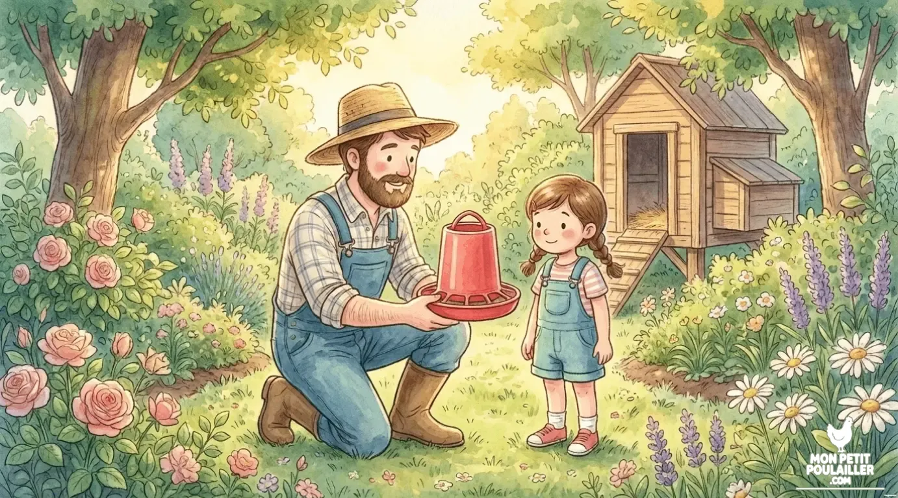
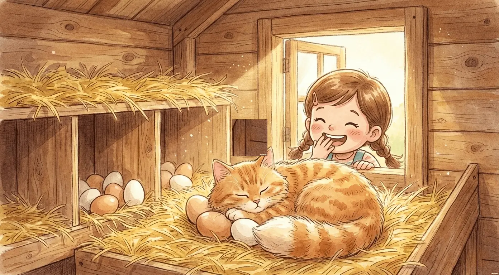
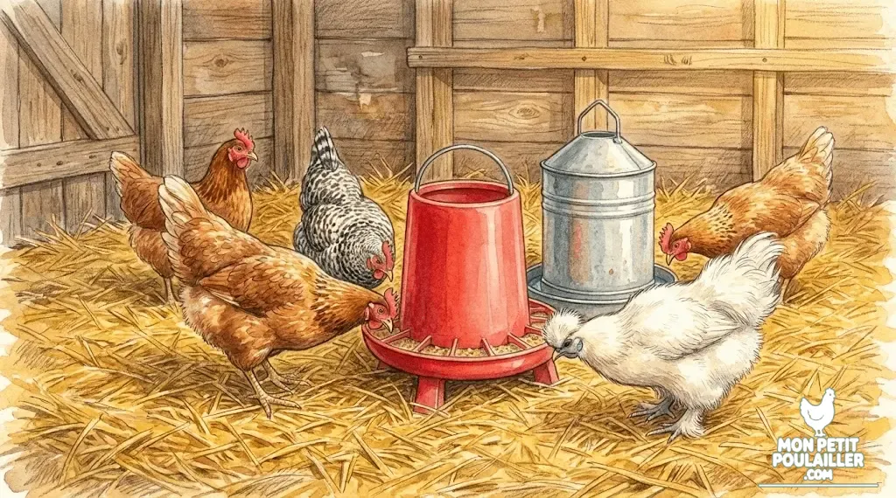

# Check-list : Les 10 Accessoires Indispensables

**L'excitation est à son comble ! Vos premières poules pondeuses arrivent bientôt, mais une question essentielle demeure : ai-je bien tout ce qu'il faut ? Un bon démarrage ne dépend pas seulement du choix de la race, mais surtout de la qualité de votre équipement de base.**

Oublier un seul accessoire peut générer du stress pour vous (comme un abreuvoir qui fuit) ou, pire, mettre en danger la santé de vos poules.

En tant que spécialiste des guides d'achat pour **Mon Petit Poulailler**, je vous ai préparé la **check-list indispensable** qui couvre tous les aspects, de l'habitat à la santé. Préparez votre panier, car ces 10 accessoires vous garantiront une transition douce vers votre nouvelle vie d'éleveur.

---
 
**Hésitation sur l'abri ?** Consultez d'abord notre comparatif : [Construire son Poulailler Soi-Même ou Acheter un Kit ?]()

---

## 1. Les 4 Éléments Clés de l'Habitat
L'habitat est le pilier de votre projet. Un poulailler sécurisé et confortable est synonyme de poules en bonne santé et de ponte régulière.

### 1. Le Poulailler (L'abri de nuit)
C'est l'investissement le plus important. Il doit protéger vos poules des prédateurs nocturnes et des intempéries.
* **Critères :** Surface de couchage d'au moins 0,5 m² par poule, bois traité (ou plastique durable), et surtout, des fermetures métalliques robustes.
* **Fonction :** Refuge de nuit et lieu de ponte.

### 2. Le Perchoir (Le Dodo en Sécurité)
Les poules dorment en hauteur par instinct de sécurité. Un perchoir est vital pour leur bien-être psychologique et physique.
* **Critères :** Installez-le à environ 50 cm du sol. La barre doit être **plate** (environ 5 cm de large) pour permettre aux poules de se reposer sans geler leurs pattes en hiver.
* **Fonction :** Lieu de repos nocturne.

### 3. Les Pondoirs (Le Trésor quotidien)
Un pondoir est un endroit sombre et sécurisant qui encourage la poule à pondre toujours au même endroit. Comme vous pouvez le voir sur l'image ci-dessous, le confort est tel qu'il attire parfois des invités surprises !

* **Critères :** Prévoyez un pondoir pour 3 à 4 poules. Ils doivent être garnis de paille ou de foin propre.
* **Fonction :** Lieu d'intimité pour la ponte.

### 4. Le Grillage de l'Enclos (Sécurité Anti-Prédateur)
Le renard est l'ennemi numéro un. Un simple filet ne suffit pas.
* **Critères :** Un grillage d'une hauteur d'au moins 1,50 m et, idéalement, enterré de 30 cm pour décourager les fouisseurs.
* **Fonction :** Protéger les poules et délimiter leur espace de liberté.

## 2. Les 3 Accessoires pour l'Eau et la Nourriture
L'alimentation doit être distribuée de manière propre et constante pour éviter le gaspillage et la contamination. Un duo mangeoire et abreuvoir de qualité est la base d'une routine saine.

### 5. L'Abreuvoir
Les poules doivent avoir accès à de l'eau fraîche 24h/24.
* **Critères :** Choisissez un modèle sur pieds ou suspendu, avec un grand réservoir pour ne pas avoir à le remplir plusieurs fois par jour.
* **Matériel recommandé :** Privilégiez un modèle de 30L sur pieds pour une grande autonomie.

### 6. La Mangeoire
Une mangeoire bien conçue évite que les poules ne grattent le sol et ne contaminent leurs graines.
* **Critères :** Privilégiez un modèle **anti-gaspillage** ou à trémie (réservoir). Il doit pouvoir contenir au moins 2 à 3 jours de nourriture.
* **Fonction :** Distribution propre et rationnée.

### 7. Le Complément Calcique (Coquilles d'huîtres)
Le calcium est vital pour la solidité des coquilles.
* **Critères :** Les coquilles d'huîtres concassées sont la meilleure source. Elles doivent être données à part.

## 3. Les 3 Produits de Santé et d'Hygiène
La prévention est votre meilleure arme contre les parasites.

### 8. La Terre de Diatomée (L'anti-parasite Naturel)
C'est l'outil numéro un pour l'hygiène.
* **Critères :** Choisissez impérativement la Terre de Diatomée **non calcinée** (amorphe) de grade alimentaire.
* **Fonction :** Lutte contre les poux rouges (parasites externes) et vermifuge naturel.

### 9. Le Vinaigre de Cidre (Tonic Naturel)
* **Critères :** Le vinaigre doit être biologique, non pasteurisé.
* **Fonction :** Acidifie l'eau pour décourager les bactéries et améliore la digestion.

### 10. Les Litières (Chanvre ou Copeaux)
* **Critères :** Évitez les copeaux de bois traités. Le chanvre est très absorbant.
* **Fonction :** Isolation et absorption de l'humidité.


**Le conseil de Martin :** Ne négligez pas la litière ! Une litière de chanvre, bien que plus chère à l'achat, dure trois fois plus longtemps que la paille et garde les pattes de vos poules bien au sec, limitant ainsi les maladies respiratoires.


## Le Top 3 pour Démarrer (Sélection de Martin)

Pour vous simplifier la vie, voici les 3 accessoires que nous considérons comme **absolument prioritaires** pour bien démarrer :

| Accessoire | Pourquoi c'est indispensable ? | Voir le prix |
| :--- | :--- | :--- |
| **Mangeoire Anti-Nuisible** | Empêche les rats de voler le grain. | [Voir sur Amazon](https://amzn.to/498l0gx) |
| **Abreuvoir 30L** | Grande autonomie et eau toujours propre. | [Voir sur Amazon](https://amzn.to/49rvFUZ) |
| **Terre de Diatomée** | L'arme absolue contre les poux rouges. | [Voir sur Amazon](https://amzn.to/3YLwj9B) |

## Conclusion
Accueillir ses premières poules est un moment merveilleux. Même si l'investissement initial peut sembler conséquent, le coût de ces accessoires est bien inférieur à celui des problèmes de santé ou des pertes dues aux prédateurs.

Choisissez la qualité pour la sécurité de vos animaux. Un équipement solide est un gage de tranquillité d'esprit et de régularité dans la récolte de vos futurs œufs frais.