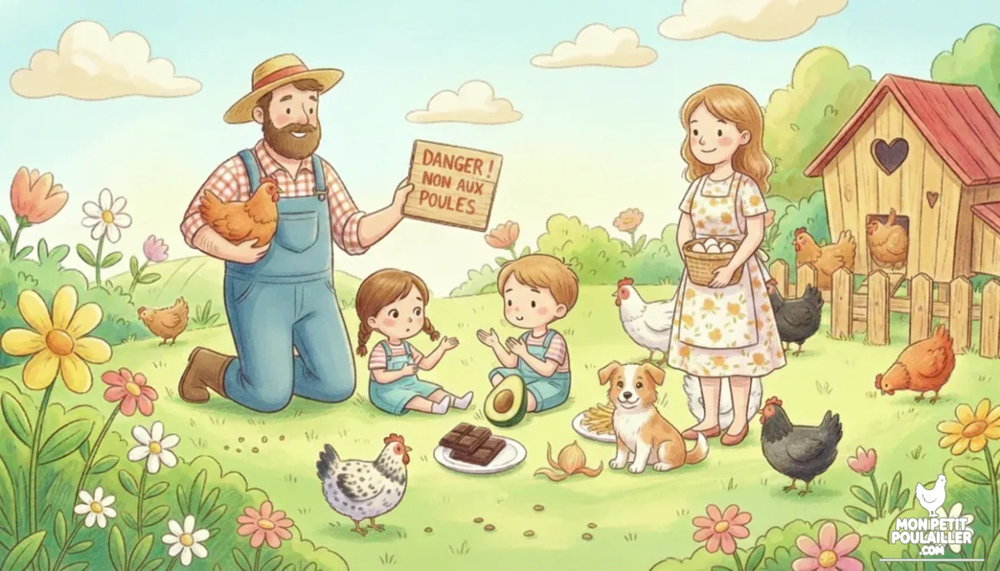
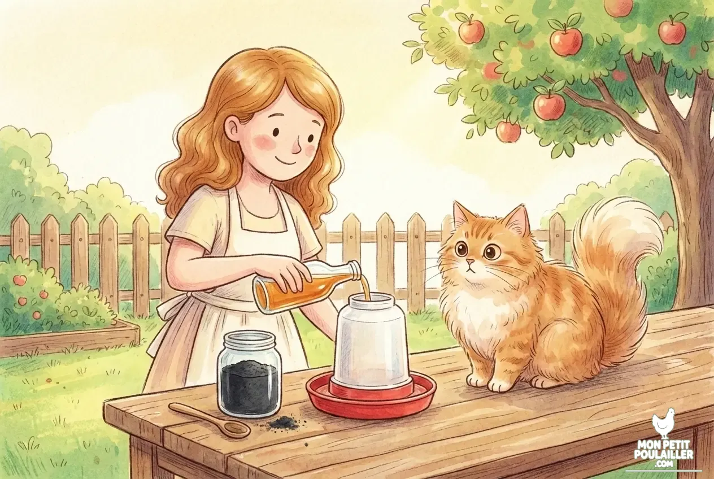

# Quels sont les aliments interdits et toxiques pour les poules ?

**La santé de vos protégées dépend avant tout de leur alimentation. Martin et Julie vous aident à faire le tri dans vos épluchures pour éviter les aliments toxiques qui pourraient mettre en danger votre petit cheptel.**

## La vigilance en cuisine avec Martin et Julie

À "Mon Petit Poulailler", la cuisine est souvent le cœur de l'activité. Si les poules sont de formidables alliées pour réduire nos déchets, Martin rappelle toujours une règle essentielle : **une poule n'est pas une poubelle de table**.

Chaque jour, Julie prépare le seau de restes avec attention. Elle sait que certains aliments courants dans nos assiettes sont de véritables poisons pour le système digestif des oiseaux. Barnabé, toujours curieux, surveille la distribution.

## Les dangers invisibles du potager et de la cuisine

Pour garantir une sécurité alimentaire totale, Martin a identifié des catégories d'aliments à bannir systématiquement :

* **La famille des Solanacées :** Ne donnez jamais de pommes de terre crues (peau et germes verts) ou de tomates vertes, car elles contiennent de la solanine.
* **L'avocat et les fruits exotiques :** La peau et le noyau de l'avocat contiennent de la persine, mortelle pour les volailles.
* **Le chocolat et le sel :** Le chocolat est fatal à cause de la théobromine.


**Attention Toxicité :** Les aliments moisis ou périmés ne doivent jamais être donnés aux poules. Le risque de botulisme est réel et souvent foudroyant.


## Le conseil de Martin pour les restes de table


**Le conseil de Martin :** Si vous avez un doute sur un aliment, mieux vaut s'abstenir. Privilégiez les légumes cuits comme les carottes ou les courgettes.


## Les indispensables pour une digestion sereine

Même avec la plus grande vigilance de Julie, un accident peut arriver. Martin conseille de toujours avoir quelques compléments naturels sous la main pour soutenir le foie et le système digestif de vos poules.

| Produit | Utilité | Format | Voir le prix |
| :--- | :--- | :--- | :--- |
| **Charbon Végétal** | Aide à absorber les toxines. | Poudre | [Voir sur Amazon](https://amzn.to/4aBweg6) |
| **Vinaigre de Cidre** | Équilibre la flore intestinale. | Liquide | [Voir sur Amazon](https://amzn.to/3N4Uz3Y) |
| **Terre de Diatomée** | Vermifuge naturel préventif. | Poudre | [Voir sur Amazon](https://amzn.to/45gtocM) |

## Conclusion : La sécurité avant tout

Comme le dit souvent Martin à Lucas et Anna : *"Mieux vaut une poule un peu déçue de ne pas avoir vos épluchures de pommes de terre qu'une poule malade."*

Si vous avez le moindre doute après une ingestion suspecte, n'attendez pas et consultez un vétérinaire spécialisé. Avec de la vigilance et les bons réflexes de Julie, votre poulailler restera un havre de paix et de santé !
