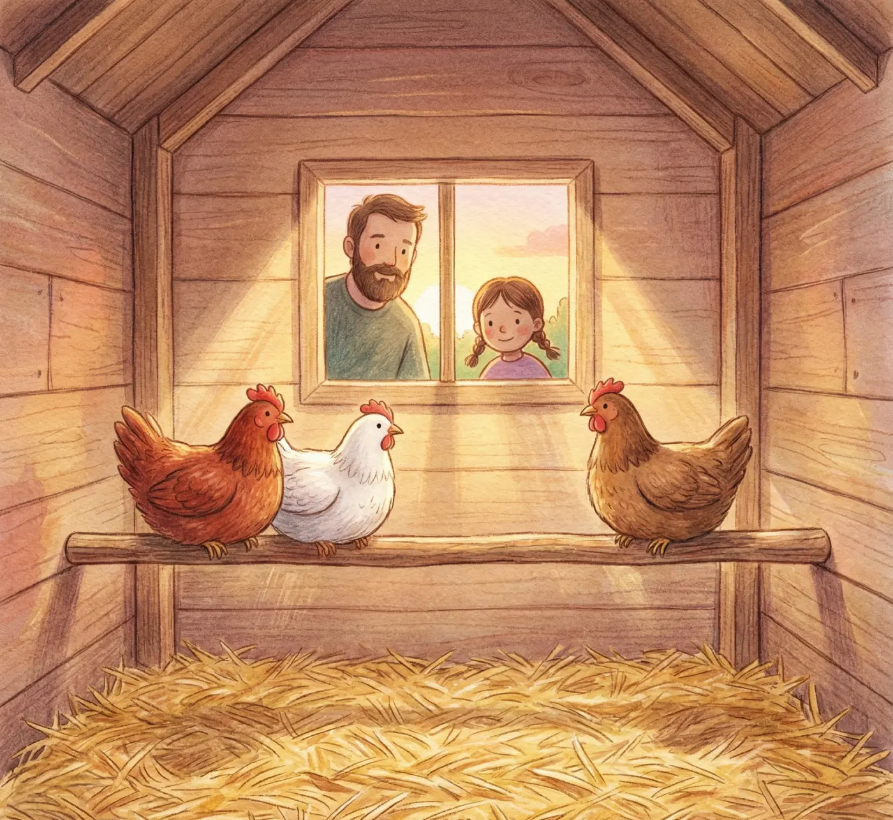


**Note de Martin :** Les 48 premières heures déterminent la hiérarchie et le sentiment de sécurité de vos poules. Ne brûlez pas les étapes !


### L'effervescence au jardin
Ce matin, le jardin a un air de fête. **Anna** court partout : les poules arrivent enfin. Pour un débutant, ce moment est aussi excitant qu'angoissant. Voici comment nous avons géré l'arrivée de nos "filles" avec **Julie**.

### 1. La descente du carton (H+1)
Dès que vous arrivez chez vous, ne lâchez pas les poules directement dans tout le jardin. Elles sont désorientées.
* **Le confinement initial** : Placez-les directement dans le poulailler fermé avec de l'eau fraîche et une poignée de grains.
* **Le calme absolu** : Expliquez aux enfants qu'il ne faut pas les toucher tout de suite. Anna a dû apprendre à les regarder par la petite lucarne sans faire de bruit.

### 2. Le premier repas "Anti-Stress"
Le trajet est un choc thermique et émotionnel. Pour les aider, Julie prépare toujours une **boisson réhydratante maison** :
* 1 litre d'eau fraîche.
* 1 cuillère à soupe de vinaigre de cidre (bio).
* Une pincée de sucre pour l'énergie.

### 3. La première nuit : Le test de sécurité (H+12)
C'est le moment le plus critique. À la tombée de la nuit, vérifiez qu'elles ont bien trouvé le perchoir. Il est fréquent que les jeunes poules s'entassent dans un coin sur la litière par peur. 
* **L'astuce de Martin** : Si elles sont au sol, posez-les délicatement sur le perchoir une par une. Elles mémoriseront ainsi leur place "en hauteur" pour les nuits suivantes.

### 4. La première sortie (H+24 à H+48)
Le lendemain, si le temps est calme, ouvrez la porte du poulailler vers l'enclos sécurisé. 
* **Laissez-les décider** : Ne les poussez pas dehors. Elles doivent sortir d'elles-mêmes pour marquer leur territoire.
* **Le périmètre réduit** : Pour ces premières 48h, nous limitons l'accès à l'enclos direct, sans leur donner tout le jardin, afin qu'elles identifient bien leur cabane comme le "refuge ultime".

---

### 📋 Checklist de Bienvenue (2026)

| Action | Pourquoi ? | Validé |
| :--- | :--- | :--- |
| **Vinaigre de cidre** | Booster le système immunitaire | [ ] |
| **Porte fermée** | Créer un sentiment de "maison" | [ ] |
| **Observation** | Détecter un éventuel picage entre elles | [ ] |
| **Litière propre** | Assurer un confort thermique immédiat | [ ] |

### Le conseil d'Anna
> "Papa dit qu'il faut leur parler doucement, comme si on leur racontait une histoire secrète. Ça les rassure et elles deviennent vite nos amies !"

---
