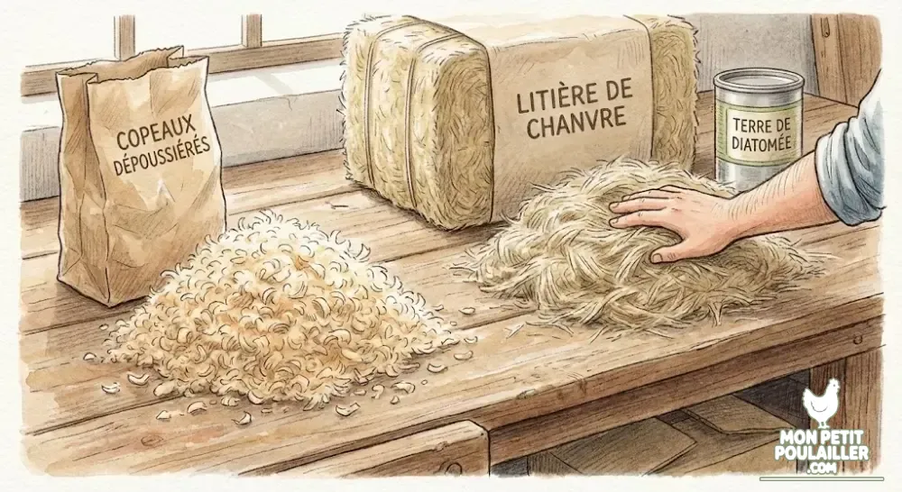
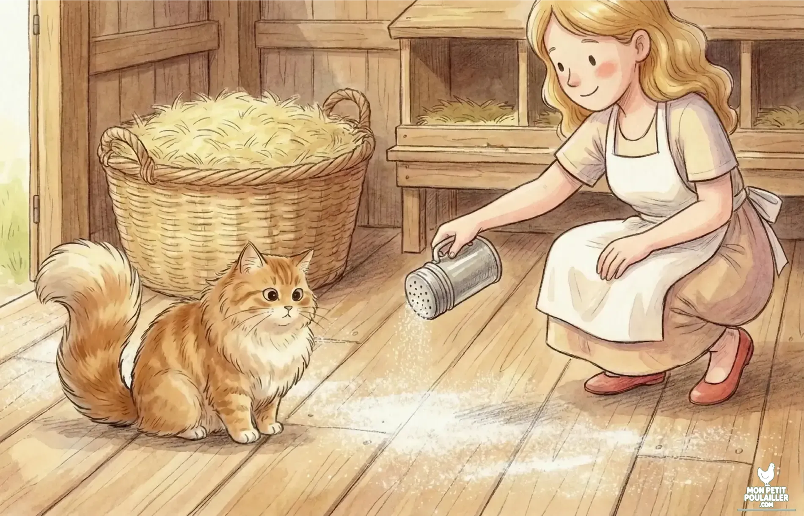

layout: "background"
heroStyle: "background"

**Le choix de la litière est déterminant pour la santé de vos poules. Contrairement aux idées reçues, la paille est souvent déconseillée dans le dortoir car elle retient l'humidité. Pour garder un poulailler sec et sans odeur, privilégiez le chanvre ou les copeaux dépoussiérés.**

---
layout: "background"
heroStyle: "background"

## Pourquoi il faut éviter la Paille
C'est l'erreur du débutant par excellence. La paille (tige jaune du blé) est constituée de tubes creux.
* **L'effet "Éponge" inversé :** L'urine coule à travers et stagne sur le bois.
* **Le nid à parasites :** Les tiges creuses sont des cachettes pour les poux rouges.
* **Les spores :** Risque de moisissures (aspergillose) pour les poumons fragiles.

*Note : Gardez la paille uniquement pour les pondoirs (les nids).*

## Le Match : Copeaux de Bois vs Chanvre

Pour le sol du dortoir, nous cherchons un matériau qui boit l'humidité comme un buvard.

### 1. Les Copeaux de Bois (Dépoussiérés)
C'est la solution économique. Attention, n'utilisez jamais de sciure de menuiserie brute !
* **Avantages :** Prix bas, bonne odeur de bois frais.
* **Inconvénients :** Moins absorbant que le chanvre.

### 2. La Litière de Chanvre : Le Choix de Martin
C'est la "Rolls" de la litière. Issue de la tige centrale du chanvre, elle agit comme une éponge naturelle.
* **Absorption record :** Jusqu'à 5 fois son volume en eau.
* **Compostable :** Se dégrade très vite au compost.


**Le conseil de Martin :** Pour une hygiène parfaite, saupoudrez un peu de Terre de Diatomée sur le plancher nu *avant* de remettre la litière propre. Cela crée une barrière asséchante sous le tapis de chanvre.


## Votre Kit "Hygiène Parfaite" (Sélection 2026)
Voici les produits exacts que nous utilisons pour nos 3-4 poules :

| Produit | Pourquoi ce choix ? | Voir le prix |
| :---
layout: "background"
heroStyle: "background"
| **Litière de Chanvre (100L)** | **Le Top (Zolux/Sicofor).** Grand volume économique. Absorbe 5x plus que la paille. | [Voir sur Amazon](https://amzn.to/4b6dvcz) |
| **Copeaux Dépoussiérés** | **L'Alternative (Duvo+).** 100% naturels et sans poussière. Odeur agréable. | [Voir sur Amazon](https://amzn.to/4shHqoq) |
| **Terre de Diatomée** | **L'Asséchant.** À saupoudrer SOUS la litière pour assainir et tuer les larves. | [Voir sur Amazon](https://amzn.to/4paDzXp) |

## La routine de nettoyage en 5 minutes
Pas besoin de tout vider tous les jours !
1. **Chaque matin :** Enlevez les fientes sous les perchoirs.
2. **Hebdo :** Remettez une poignée de litière fraîche.
3. **Mensuel :** Videz tout, désinfectez et remplacez intégralement.

---
layout: "background"
heroStyle: "background"
*Si vous voulez éviter les maladies et ne pas vous boucher le nez en ouvrant le poulailler, oubliez la paille !*
