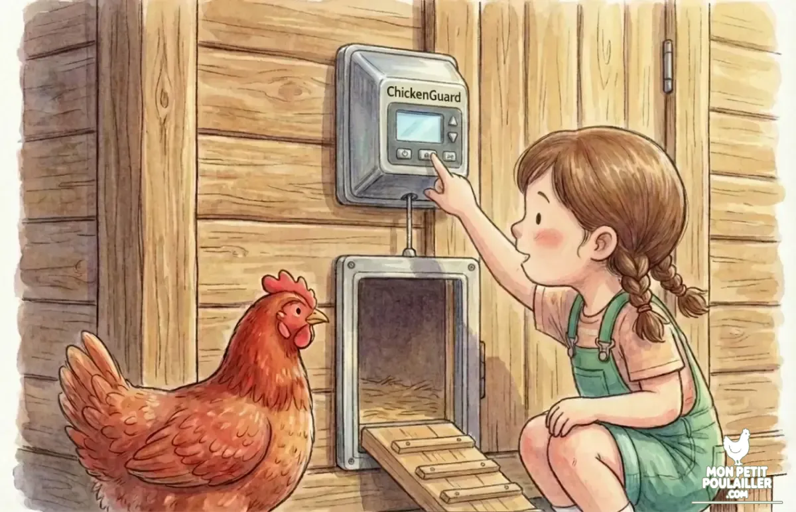

**Le choix entre construire son poulailler (DIY) ou acheter un kit dépend de votre arbitrage entre temps, budget et durabilité. Mais attention : pour commencer un élevage sain, il faut accueillir au minimum 3 à 4 poules (animaux grégaires).**

---

Accueillir ses premières poules à \"Mon Petit Poulailler\" est toujours une fête. **Lucas** et **Anna** trépignent d'impatience, mais avant de ramasser les œufs, il faut décider où elles vont dormir. En tant que menuisier, j'ai souvent débattu de cette question avec **Julie** : faut-il sortir la scie circulaire ou déballer un carton ?

N'hésitez pas à consulter notre guide sur les [10 Accessoires Indispensables]() pour compléter votre installation.

## La Règle d'Or : Dimensionner pour 3 Poules
Avant de parler marteau ou tournevis, fixons la règle de base. Une poule ne vit jamais seule. Pour éviter le stress et garantir un équilibre social en cas de perte, **le minimum vital est de 3 poules.**

Cela impacte directement votre projet :
* **Surface Dortoir :** Il faut compter 1 m² pour le confort de 3-4 poules.   
* **Les Kits \"Pas chers\" :** Attention aux modèles à moins de 100€ souvent vendus comme \"poulaillers\". Ils sont trop petits pour un trio et provoquent picage et maladies.

## Le Poulailler DIY (Fait Maison) : Pour le sur-mesure

Construire soi-même son abri, c'est l'assurance d'une qualité supérieure. Vous choisissez des bois durables (classe 4) qui tiendront 20 ans.

### Avantages :
* **Solidité :** Face aux prédateurs (renards, fouines), une structure en bois massif de 20mm est imprenable.
* **Isolation :** Vous pouvez isoler les parois pour l'hiver, ce qui est impossible sur un kit.


**Alerte Sécurité de Martin :** Pendant que vous bricolez, vos poules risquent de venir picorer autour de vous. Soyez vigilants : ne leur donnez jamais de reste de goûter contenant de l'**avocat** ou du **chocolat**, car c'est mortel pour elles !


## Le Kit Prêt à Monter : La simplicité (si bien choisi)
C'est la solution \"clé en main\". Idéale pour démarrer sans être bricoleur, à condition de choisir un modèle \"XXL\".

## Le Comparatif Financier (Pour 3-4 Poules)

| Élément de Coût | DIY (Matériaux Neufs) | Kit Prêt à Monter (Qualité) |
| :--- | :--- | :--- |
| **Total Estimé** | **450 € - 650 €** | **250 € - 400 €** |

## Notre Sélection \"Format Familial\"
Pour ne pas vous tromper, voici une sélection adaptée à un démarrage avec 3 poules :

| Produit | Pourquoi ce choix ? | Voir le prix |
| :--- | :--- | :--- |
| **Poulailler Surélevé (Renforcé)** | **Le choix Durable.** Pieds protégés de l'humidité. | [Voir sur Amazon](https://amzn.to/45uaKOB) |
| **Moteur ChickenGuard PRO** | **Le Top du marché.** Sonde + Minuterie. | [Voir sur Amazon](https://amzn.to/4pd3mhy) |
| **Mangeoire à Pédale (5kg)** | **Anti-Rat.** Indispensable dès 3 poules. | [Voir sur Amazon](https://amzn.to/3LgASpg) |

***(Note : Les capacités annoncées par les fabricants sont souvent exagérées. Un modèle vendu pour \"6 poules\" est souvent parfait pour 3 ou 4.)*** ## Conclusion
Le kit gagne sur le terrain du prix et de la rapidité, c'est un excellent tremplin pour débuter. Le DIY est un investissement sur 20 ans. Quel que soit votre choix, respectez la règle des 3 poules !

---