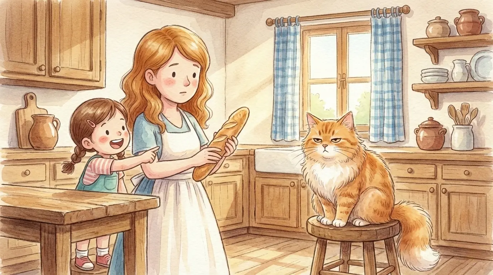
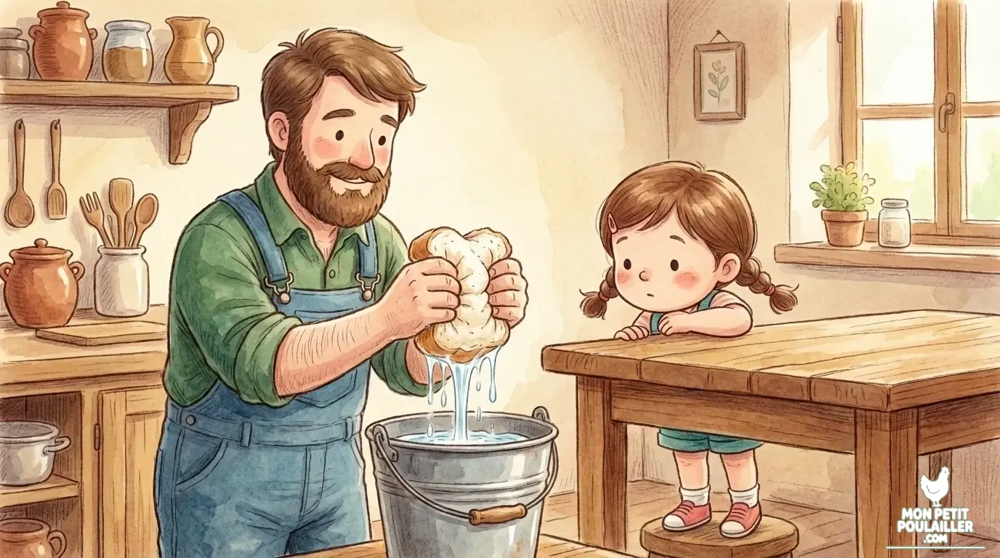
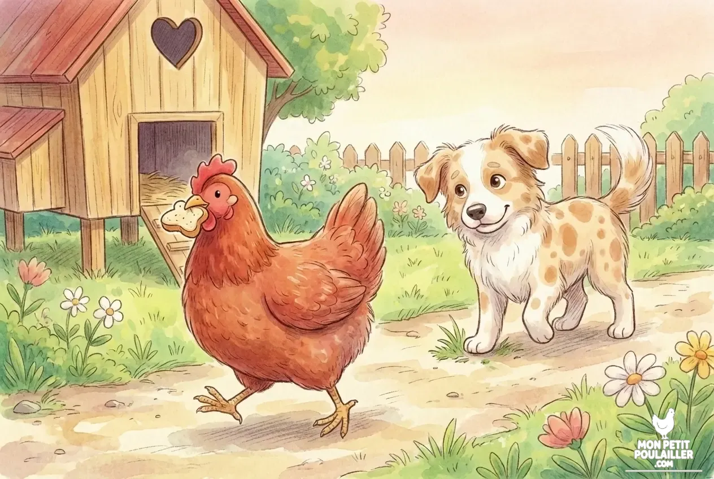

layout: "background"
heroStyle: "background"

**Oui, vous pouvez donner du pain à vos poules, mais uniquement en tant que friandise occasionnelle (maximum une fois par semaine). Pour éviter tout danger, le pain doit être sec, longuement trempé dans l'eau puis vigoureusement pressé afin d'éliminer l'excès de sel.**

---
layout: "background"
heroStyle: "background"

À "Mon Petit Poulailler", **Julie** a horreur du gaspillage. Dès qu'une baguette commence à durcir sur le comptoir, le premier réflexe est de vouloir la donner à nos pondeuses. Cependant, si le pain semble être un régal pour elles, il cache des pièges que tout éleveur débutant doit connaître. 

## Les 3 Dangers du Pain en Excès

1. **L'Excès de Sel :** Le pain contient beaucoup de sodium. Le système rénal des poules gère très mal le sel.
2. **Le Blocage du Jabot :** Le pain sec gonfle. S'il stagne, il peut former une boule compacte mortelle.
3. **L'Effet "Fast-Food" :** Riche en glucides mais pauvre en protéines, le pain fait grossir les poules, ce qui stoppe la ponte.


**Alerte Sécurité de Martin :** Pendant que vous triez vos restes, soyez vigilants ! Ne donnez jamais d'**avocat** ou de **chocolat** à vos poules. Ces aliments sont des poisons mortels, bien plus dangereux qu'un morceau de pain rassis.



**ATTENTION MOISISSURES :** Ne donnez jamais de pain même légèrement moisi. Les mycotoxines présentes dans le pain rassis sont extrêmement toxiques pour le foie des volailles et peuvent provoquer une mort foudroyante.


## La Méthode Martin : Préparer le pain sans danger

* **Le Trempage Total :** Utilisez uniquement du pain **sec et dur**. Faites-le tremper dans un grand volume d'eau pendant plusieurs heures.
* **L'Égouttage Rigoureux :** Pressez le pain très fortement entre vos mains pour extraire l'eau salée avant de le servir.


**Le conseil de Martin :** Ne donnez jamais de pain plus d'une fois par semaine. La portion ne doit pas dépasser l'équivalent d'une cuillère à soupe par poule.


## Pour une alimentation équilibrée
La santé de vos poules repose avant tout sur un mélange de graines de qualité et des minéraux adaptés.

| Produit | Utilité & Format | Voir le prix |
| :---
layout: "background"
heroStyle: "background"
| **Graines Premium Eggersmann** | Mélange de céréales haute qualité. **Format 5 kg**. | [Voir sur Amazon](https://amzn.to/4sf8ODD) |
| **Grit & Minéraux Ida Plus** | Aide à la digestion et renforce la coquille. **Format 6 kg**. | [Voir sur Amazon](https://amzn.to/49dJQM6) |


**Note de transparence :** Le mélange Eggersmann est un aliment complémentaire à 10% de protéines. Il est parfait en complément d'un jardin ou d'un apport en protéines pour atteindre les 16% nécessaires à la ponte.


## Conclusion
Le pain peut rester un plaisir partagé si vous respectez le protocole de trempage. N'oubliez pas que tout comme il faut neutraliser la solanine dans les [pommes de terre](), il faut neutraliser le sel du pain !

---
layout: "background"
heroStyle: "background"
**Pour aller plus loin :** [Guide Complet des Aliments Interdits et Toxiques]()
