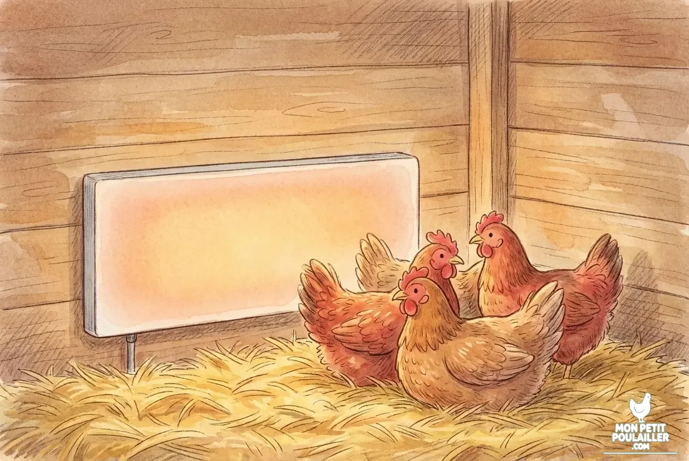
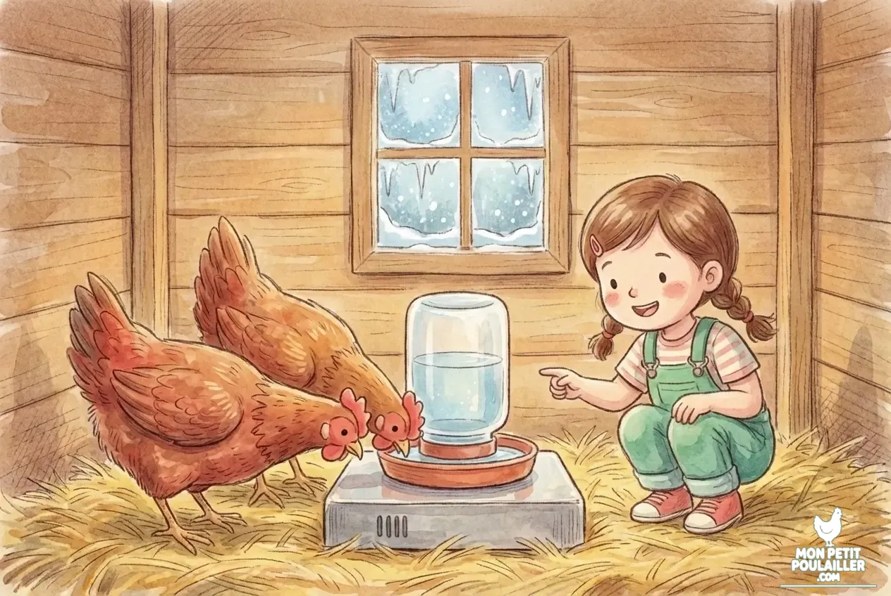

**L'hiver approche et avec lui le défi du gel et de l'humidité. Pour protéger vos poules, cinq équipements font la différence : une porte automatique isolante, un chauffage radiant sécurisé, un abreuvoir antigel, un éclairage adapté et une alimentation riche. Voici l'essentiel à retenir.**

---

L'hiver s'est installé à "Mon Petit Poulailler". On entend souvent que les poules sont robustes, mais c'est l'humidité combinée aux courants d'air qui représente le vrai danger. Avec **Julie**, nous avons identifié les cinq piliers pour sécuriser leur abri sans transformer le poulailler en étuve.

## 1. La Porte Automatique & l'Isolation
Le vent est l'ennemi n°1. L'objectif est de bloquer les courants d'air tout en conservant la chaleur naturelle des poules.

* **L'atout maître :** Une porte automatique garantit une fermeture hermétique dès la nuit tombée, emprisonnant les calories à l'intérieur tout en bloquant le vent glacial.
* **En savoir plus :** [Pourquoi la porte automatique est un investissement indispensable]()

## 2. Le Chauffage Radiant (Plaques)

Contrairement aux lampes rouges énergivores et risquées, la plaque chauffante diffuse une chaleur douce par rayonnement. C'est l'équipement idéal pour les nuits de grand gel afin d'éviter les gelures de crêtes.

### 🛡️ Sélection Sécurité Hiver 2026
| Équipement | Avantage Martin | Lien de confiance |
| :--- | :--- | :--- |
| **Plaque Standard** | Consommation ultra-faible (20W), sécurité thermique intégrée. | [Vérifier le prix](https://amzn.to/3L77fa2) |
| **Plaque avec Thermostat** | Se coupe automatiquement selon la température ambiante. | [Vérifier le stock](https://amzn.to/4qvoiSh) |

## 3. L'Abreuvoir Chauffant (Antigel)

Une poule est composée à 75 % d'eau. Si son eau gèle, elle s'arrête de pondre instantanément. Maintenir l'eau liquide est donc la priorité absolue.

* **La solution de Martin :** Un socle chauffant universel qui se glisse sous n'importe quel abreuvoir.
* **Guide Complet :** [Tout savoir sur les abreuvoirs chauffants]()

## 4. L'Éclairage Additionnel
Le manque de lumière hivernale bloque l'ovulation. Pour maintenir une ponte régulière, un appoint lumineux est souvent nécessaire pour atteindre 14h de luminosité.

## 5. Alimentation & Soins des Extrémités
La poule brûle énormément de calories pour lutter contre le froid. Sa ration doit être renforcée en maïs et tournesol.

* **Le secret d'Anna :** Appliquer un corps gras (Vaseline ou DermoGel) sur les crêtes des poules les plus sensibles pour éviter les brûlures dues au gel.


**Le conseil du menuisier :** Je vous recommande des perchoirs plats et larges (8-10 cm). Cela permet aux poules de recouvrir totalement leurs pattes avec leurs plumes lors de leur sommeil.


## Conclusion
Avec ces équipements, vos poules traverseront l'hiver en pleine santé. **Lucas** et **Barnabé** sont déjà prêts pour la neige !

---
**À lire également :** [Guide de survie : Neige et Gelures]()
