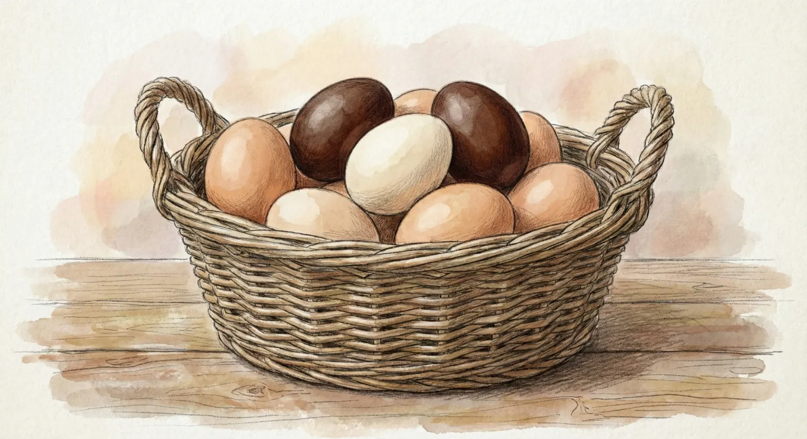

**Pour débuter votre poulailler sans stress, la meilleure race est la Poule Rousse (productivité record), suivie de la Sussex (excellente pondeuse d'hiver) et de la Harco (très rustique). Si vous cherchez un animal de compagnie pour vos enfants, la Poule Soie est inégalable par sa douceur, tandis que la Marans ravira les gourmets avec ses œufs couleur chocolat.**

---

Imaginez la scène à "Mon Petit Poulailler" : c'est un matin frais et la rosée perle sur l'herbe. **Anna** et **Lucas** courent vers le jardin, impatients de découvrir les trésors du jour. Soulever le pondoir et découvrir deux magnifiques œufs frais, pondus il y a à peine quelques heures, est une satisfaction incroyable.

## Les 3 critères de Martin pour bien choisir
Avant de craquer pour un joli plumage, j'ai appris avec **Julie** qu'il faut regarder trois points techniques :
1. **La capacité de ponte :** Cherchez une régularité entre 200 et 300 œufs par an.
2. **Le caractère :** Privilégiez des races calmes, surtout avec des enfants.
3. **La rusticité :** La résistance naturelle aux maladies et aux écarts de température.

## Le Top 5 des races pour débuter

### 1. La Rousse (Isa Brown) : La championne
C'est la star incontestée des jardins. Elle est incroyablement familière, au point de devenir "pot de colle" avec nous.

### 2. La Sussex : La force tranquille
Reconnaissable à son plumage blanc herminé. C'est une excellente pondeuse d'hiver.

### 3. La Harco : La rustique
Elle résiste particulièrement bien aux climats humides et froids.

### 4. La Poule Soie : La peluche du jardin
Anciennement "Nègre-Soie", son plumage ressemble à de la fourrure. Idéale pour les câlins avec les enfants.

### 5. La Marans : L'œuf de prestige
Elle est célèbre pour ses œufs "extra-roux" couleur chocolat foncé.


**Le conseil de Martin :** Ne commencez jamais avec une seule poule. La poule a un besoin vital de vie sociale. Offrez-lui toujours au moins une copine pour explorer le jardin sous la surveillance de **Barnabé**.


## Tableau Comparatif

| Race | Œufs / an | Couleur de l'œuf | Note Facilité |
| :--- | :--- | :--- | :--- |
| **La Rousse** | ~ 300 | Roux clair | 5/5 |
| **La Sussex** | ~ 240 | Beige / Rosé | 5/5 |
| **La Soie** | ~ 150 | Crème | 4/5 |
| **La Marans** | ~ 200 | Chocolat | 4.5/5 |

## Conclusion
Peu importe votre choix, l'aventure du poulailler domestique est une expérience enrichissante. En commençant avec des animaux en bonne santé, vous ne regretterez pas votre décision !