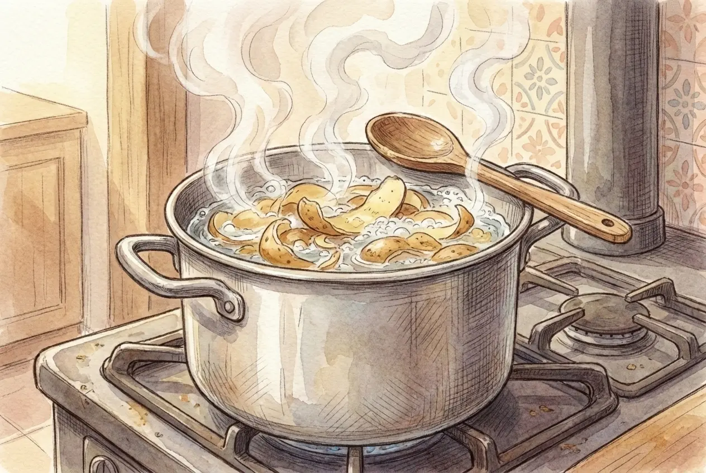
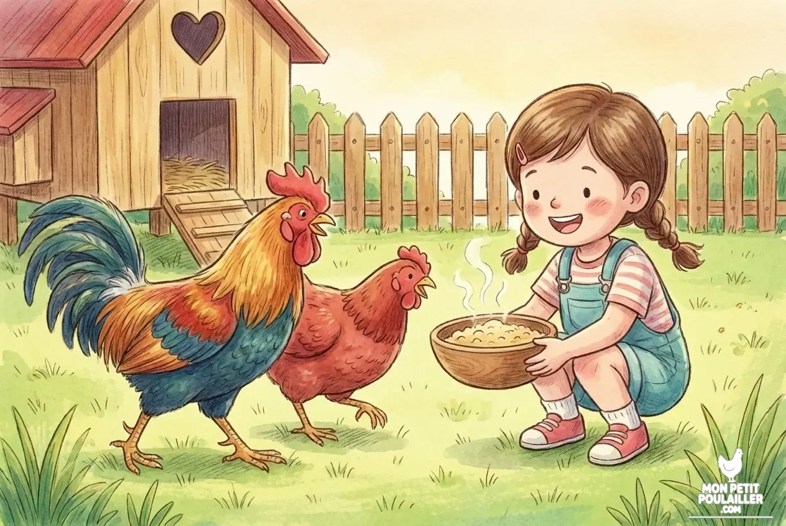

**Il ne faut jamais donner d'épluchures de pommes de terre crues aux poules car elles contiennent de la solanine, une substance toxique pouvant entraîner une paralysie mortelle. Pour les offrir en toute sécurité, vous devez impérativement les cuire à l'eau pendant 20 minutes, jeter l'eau de cuisson et les distribuer avec modération.**

---

À "Mon Petit Poulailler", rien ne se perd ! **Anna** adore m'aider à trier les restes de cuisine pour les donner à nos pondeuses, sous la surveillance toujours très intéressée de **Barnabé**. Mais attention : recycler ses déchets est une excellente idée, à condition de ne pas transformer une friandise en danger pour la santé de vos poules.

## Pourquoi les épluchures crues sont-elles toxiques ?
Le danger principal porte un nom : la **solanine**. C'est un poison naturel que l'on trouve dans les légumes de la famille des Solanacées (pommes de terre, mais aussi tomates vertes ou aubergines).


**DANGER MORTEL :** La solanine est concentrée dans la **peau**, les **germes** et les **parties vertes**. Une ingestion de pommes de terre crues ou verdies peut tuer une poule en quelques heures (paralysie respiratoire).


## Le Protocole de Sécurité (La méthode Martin)

Heureusement, la solanine est détruite par la chaleur. Pour valoriser vos épluchures, suivez rigoureusement ces étapes :

1. **Le Tri :** Jetez impérativement toutes les parties vertes et les germes. Même cuits, ils restent dangereux.
2. **La Cuisson :** Faites bouillir les épluchures pendant **15 à 20 minutes** jusqu'à ce qu'elles soient bien tendres.
3. **Le Rinçage :** Égouttez soigneusement.


**Le conseil de Martin :** Jetez impérativement l'eau de cuisson ! La solanine s'y dissout pendant l'ébullition. Si vous utilisez cette eau pour préparer une pâtée, vous réintroduisez le poison que vous veniez d'éliminer.


## Équilibrer les restes de cuisine
Les épluchures cuites sont une source d'énergie (amidon), mais elles sont pauvres en protéines et en calcium. Pour maintenir la ponte et la santé de vos poules, vous devez compenser ces manques.

| Produit | Utilité | Voir le prix |
| :--- | :--- | :--- |
| **Mélange de Graines Premium** | Apport en céréales de haute qualité (Sans OGM). | [Voir sur Amazon](https://amzn.to/4sf8ODD) |
| **Grit & Minéraux** | Aide à la digestion et renforce la coquille des œufs. | [Voir sur Amazon](https://amzn.to/49dJQM6) |

## La règle d'or des quantités : Pas d'excès !

Même bien cuites, les pommes de terre ne doivent jamais remplacer le mélange de graines.

**Respectez la règle des 15% :** Les restes de cuisine ne doivent pas représenter plus d'une petite cuillère à soupe par poule et par jour.

## Conclusion
Recycler ses épluchures est un geste écologique, mais la **cuisson** est votre seule garantie. En respectant ces réflexes, vous offrirez une friandise appréciée sans risque !

---
**Pour aller plus loin :** [Aliments Interdits et Toxiques pour les Poules : Le Guide Complet]()
