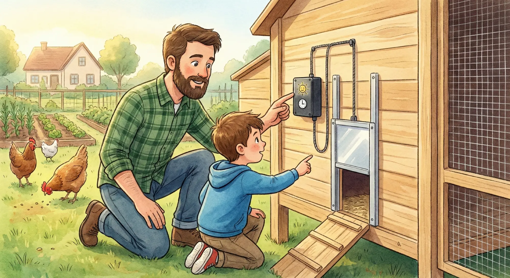

**Combien de fois le doux rêve d'une grasse matinée a-t-il été brisé par le besoin de libérer vos protégées ? La porte automatique n'est pas un gadget : c'est l'investissement le plus crucial pour la sécurité de vos poules et votre tranquillité d'esprit.**

---

Vous êtes un fier éleveur, mais avouons-le : qui n'a jamais été pris d'une sueur froide en rentrant tard, se demandant : \"Ai-je bien fermé la porte du poulailler ?\" Ce dilemme a trouvé sa solution dans la domotique de basse-cour.

## Comment ça marche ? Lumière ou Minuterie ?
Une porte automatique motorisée coulisse une trappe grâce à un cerveau électronique.

### 1. Le Capteur de Luminosité (Mode Crépusculaire)
C'est le mode le plus proche du rythme naturel. La porte suit le soleil.
* **Avantage :** Adaptation automatique aux saisons.
* **Inconvénient :** Peut être perturbé par un éclairage extérieur puissant.

### 2. La Minuterie Programmable (Mode Horloge)
* **Principe :** Vous fixez l'heure précise (ex. 7h00 / 21h30).
* **Idéal si :** Votre poulailler est situé dans une zone très ombragée.


**Le conseil de Martin :** Privilégiez les modèles avec **mode hybride**. On utilise la luminosité pour l'ouverture, mais on force une heure de fermeture de sécurité.


## Les 3 Avantages Majeurs selon Martin et Julie

1. **Sécurité Anti-Prédateur :** Le renard frappe souvent au crépuscule. La porte automatique se verrouille au moment critique.
2. **Sommeil Réparateur :** Finies les sorties en pyjama sous la pluie à 6h du matin.
3. **Liberté d'Absence :** Partez en week-end l'esprit tranquille, la technologie veille sur le cheptel.


**Alerte Sécurité de Martin :** Pendant que vous installez votre nouvelle porte, gardez vos poules à l'œil. Assurez-vous qu'elles n'accèdent pas à la cuisine : l'**avocat** et le **chocolat** sont des poisons mortels !


## Notre Sélection des Meilleurs Modèles (3-4 poules)

| Modèle Phare | Pourquoi on l'aime ? | Énergie | Voir le prix |
| :--- | :--- | :--- | :--- |
| **Chamuty (Solaire)** | Le plus complet avec son panneau déporté. | Solaire | [Voir sur Amazon](https://amzn.to/3YL2R3w) |
| **Run-Chicken** | Conception robuste en aluminium, ultra compact. | Piles | [Voir sur Amazon](https://amzn.to/4b4UpUg) |
| **ChickenGuard** | La référence historique, fiabilité et écran LCD clair. | Piles | [Voir sur Amazon](https://amzn.to/3KTWNCO) |

## Installation : La minute du menuisier
Rassurez-vous : pas besoin d'être un expert. La plupart des modèles se fixent en **20 minutes** avec 4 vis.

## Conclusion
Si vous ne deviez acheter qu'un seul accessoire \"technique\", c'est celui-ci. Pour la sécurité de vos poules et votre liberté, le retour sur investissement est immédiat.

---
**ASTUCE :** Découvrez aussi notre [Check-list des 10 Accessoires Indispensables]() pour compléter votre installation.