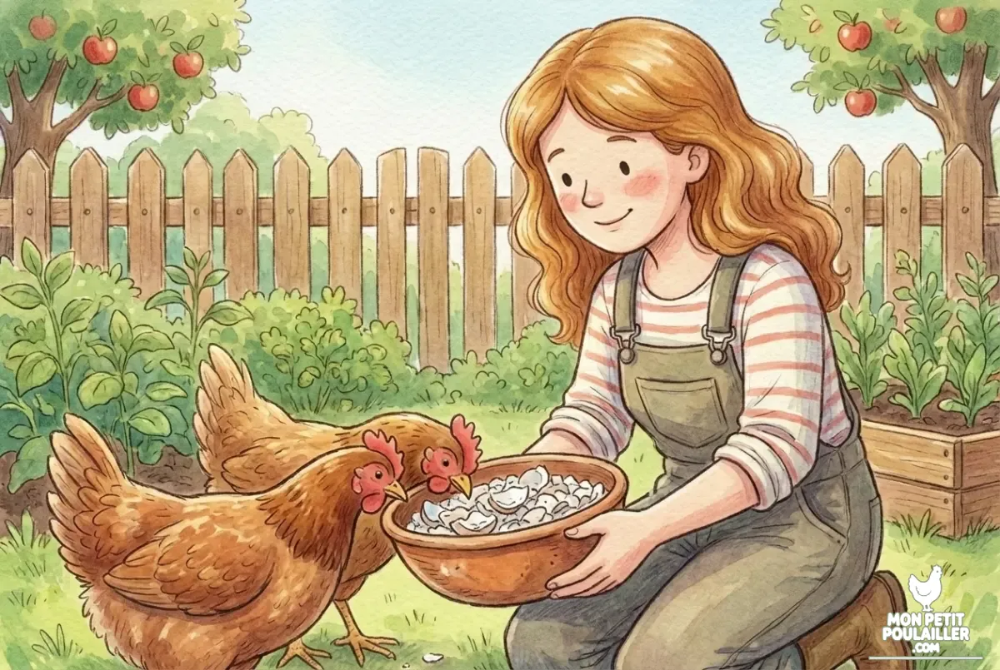

layout: "background"
heroStyle: "background"

**L'arrêt de la ponte chez une poule est généralement causé par des facteurs naturels ou environnementaux : la baisse de luminosité saisonnière, la mue annuelle, le stress ou une alimentation déséquilibrée.**

---
layout: "background"
heroStyle: "background"

C'est un petit drame matinal à "Mon Petit Poulailler" : **Anna** revient avec son panier vide et une mine déçue. Même **Barnabé** semble perplexe devant le nichoir déserté. Pas de panique ! En tant qu'éleveur, j'ai appris que l'arrêt de la ponte n'est souvent qu'une réaction logique de l'organisme.

## 1. La baisse de luminosité : le repos hivernal
La ponte est régie par la lumière du jour. En dessous de **12 à 14 heures de lumière**, la production d'œufs ralentit. C'est une pause naturelle qui permet à la poule de préserver ses ressources énergétiques durant l'hiver.

## 2. La mue annuelle : un chantier énergétique
Chaque année, à l'automne, vos poules renouvellent leur plumage. La fabrication des plumes consomme une quantité massive de protéines.

## 3. L'alimentation et les carences
Faire un œuf demande énormément de calcium et de protéines. Si vos poules consomment trop de restes de table (comme le pain), elles risquent une carence. 


**Alerte Sécurité de Martin :** Attention à ce que vous donnez en cuisine ! Ne donnez jamais d'**avocat** ou de **chocolat**, car ces aliments sont mortels pour vos poules, surtout lorsqu'elles sont déjà affaiblies par une mue.



**Le conseil de Martin :** Veillez à ce que vos poules mangent d'abord leur aliment complet le matin. Un apport en coquilles d'huîtres est indispensable pour la solidité de la coquille.


## Solutions pour relancer la ponte

| Produit | Utilité & Conseil | Voir le prix |
| :---
layout: "background"
heroStyle: "background"
| **Coquilles d'Huîtres** | Calcium pur pour la coquille. | [Voir sur Amazon](https://amzn.to/4qtImV0) |
| **Mélange de Graines** | Riche en protéines (15kg/mois pour 3 poules). | [Voir sur Amazon](https://amzn.to/45y9Xw7) |
| **Vitamines (Liquide)** | Idéal lors de la mue ou des grands froids. | [Voir sur Amazon](https://amzn.to/3LeHip4) |

## 4. Le stress et la sécurité du poulailler
Une poule stressée cesse immédiatement de pondre. La présence d'un prédateur ou une infestation de [poux rouges]() peut traumatiser vos oiseaux. Sécuriser l'habitat avec une [porte automatique]() aide à stabiliser leur environnement.

## 5. L'âge et la génétique
Enfin, la capacité de ponte diminue avec le temps. [Le choix de la race]() influence grandement la régularité de votre récolte.

## Conclusion
Le nichoir vide n'est pas une fatalité. En assurant une sécurité optimale et une alimentation riche, vous aiderez vos protégées à retrouver le chemin du pondoir !
