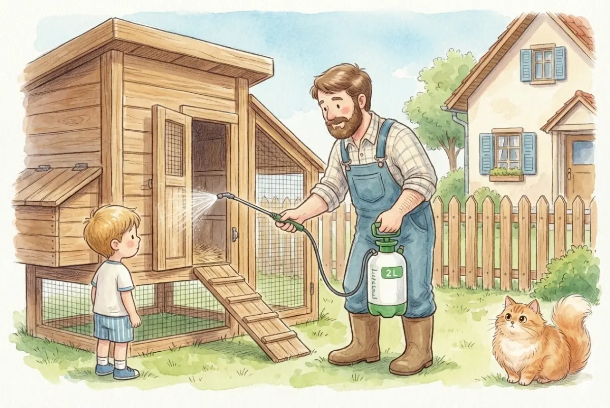
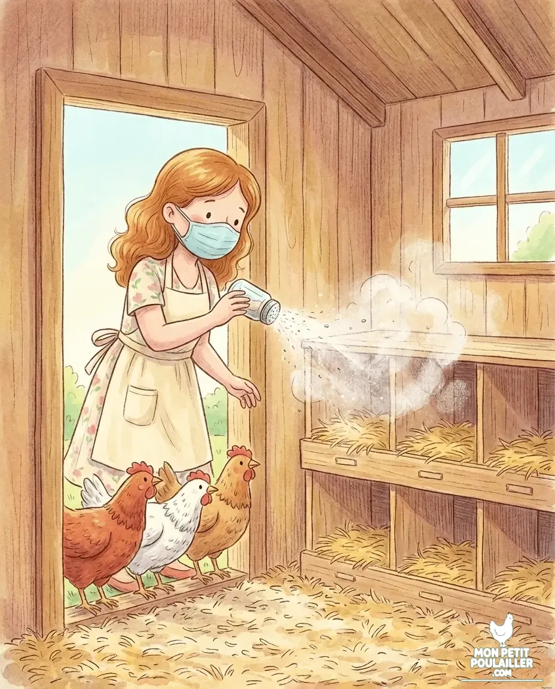
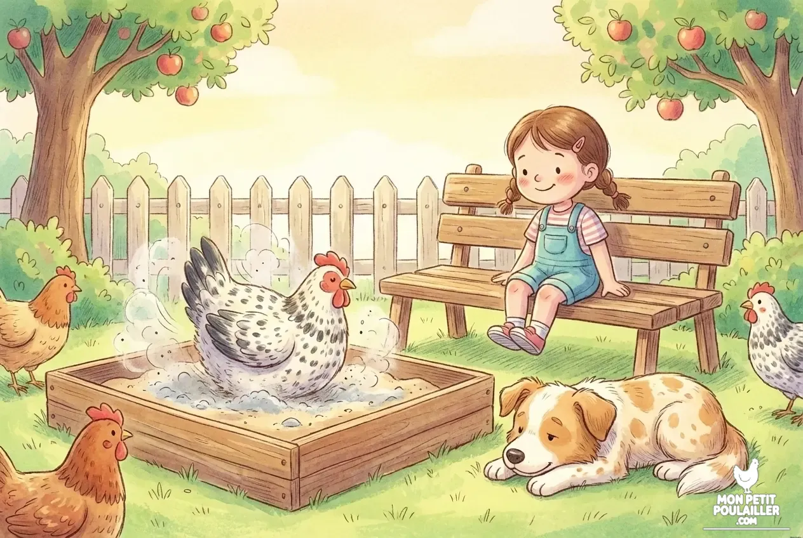

**Le pou rouge est un acarien nocturne redoutable. En 2026, l'éradication repose sur une détection précoce (test du torchon blanc), un nettoyage haute pression intégral et l'application de Terre de Diatomée tous les 5 à 7 jours.**

À "Mon Petit Poulailler", nous redoutons tous cet ennemi invisible. Comme le dit souvent **Anna**, voir ses poules préférées s'affaiblir est un crève-cœur. Heureusement, avec de la rigueur, on peut gagner cette bataille.

---

## 1. Détection : Le Test du Torchon Blanc
Si vos poules refusent de dormir dans le poulailler, suspectez immédiatement les poux. Étalez un linge blanc sous les perchoirs le soir ; si vous voyez des taches rouges au matin, l'infestation est confirmée.

## 2. Le Plan d'Attaque de Martin

### Étape 1 : Le Grand Nettoyage
Videz tout ! Utilisez un nettoyeur haute pression pour déloger les œufs des fissures du bois. 


**Alerte Santé de l'Expert :** Ne donnez jamais d'**avocat** ou de **chocolat** à vos poules affaiblies. Ces aliments sont des poisons mortels. Pour les aider à récupérer, privilégiez une alimentation saine.


### Étape 2 : Protection et Hygiène
Appliquez de la Terre de Diatomée. Pensez aussi à vérifier votre [choix de litière]() : une litière propre et sèche est votre meilleure alliée contre l'humidité que les parasites adorent.

## 3. La Prévention : Le Secret d'Anna
Mieux vaut prévenir que guérir ! Le meilleur moyen d'empêcher le retour des parasites est de laisser vos poules prendre soin d'elles-mêmes. 

**Anna** adore remplir un vieux pneu ou un bac avec un mélange de sable fin et de **Terre de Diatomée**. Les poules s'y roulent avec délice : c'est leur "spa" naturel qui déchiquette les carapaces des insectes avant qu'ils ne deviennent un problème.

## Votre Kit de Survie Anti-Poux

| Solution | Utilité | Voir le prix |
| :--- | :--- | :--- |
| **Terre de Diatomée** | L'arme naturelle n°1. | [Voir sur Amazon](https://amzn.to/4paDzXp) |
| **Pulvérisateur 2L** | Pour les fissures du bois. | [Voir sur Amazon](https://amzn.to/3NkZ5eL) |


**Le conseil de Martin :** En tant que menuisier, je vous recommande d'enduire vos structures en bois d'huile de lin deux fois par an. Cela bouche les cachettes des poux.


---
**En savoir plus :**
* [Check-list des accessoires indispensables]()
* [La réglementation pour poulailler urbain en 2026](/posts/reglementation-poulailler-ville/)
