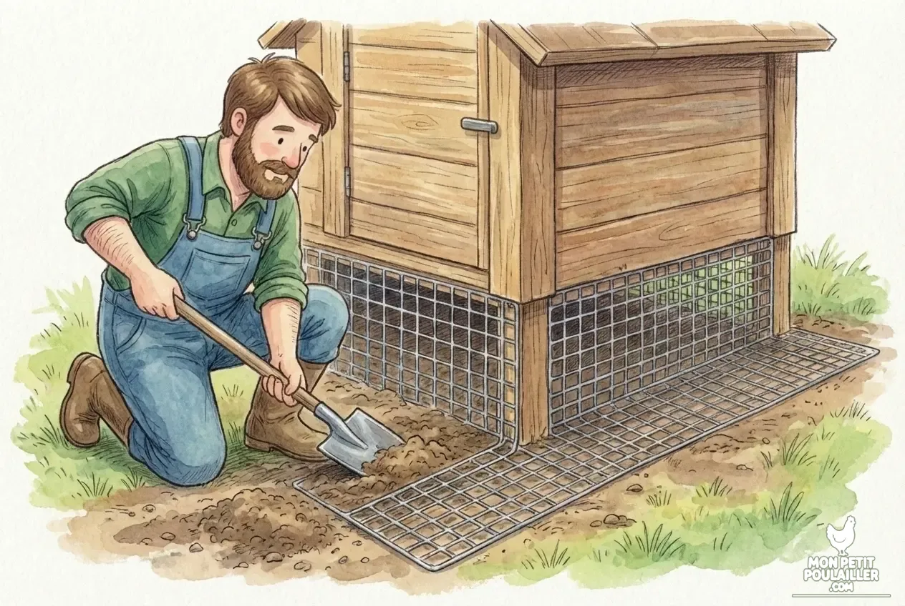

**Sécuriser son poulailler contre les prédateurs est une priorité absolue. À \"Mon Petit Poulailler\", Martin et Barnabé veillent au grain : entre routine du soir et équipements robustes, découvrez comment protéger vos poules des renards et des fouines.**

---

L'hiver et les nuits qui tombent tôt sont les moments préférés des prédateurs. Chaque soir, dès que le ciel vire au gris, j'entame ma ronde de sécurité. Je suis toujours accompagné de **Barnabé**, notre Border Collie Sable.

## La règle d'or : Ne jamais attendre la nuit
Le renard est un opportuniste. Ma première règle est simple : **n'attendez jamais la nuit noire pour fermer.** À peine le soleil couché, les poules rentrent d'elles-mêmes.

## 3 points de contrôle pour un poulailler imprenable

En tant que menuisier, j'ai vu trop de poulaillers \"en kit\" avec des verrous fragiles. Voici ce que je vérifie systématiquement :

1. **Les Verrous :** Utilisez des loquets à ressort ou des targettes solides.
2. **Le Grillage :** Pour stopper une fouine, il faut une maille soudée de 19mm maximum.
3. **Le Sous-sol :** J'enterre toujours mon grillage en \"L\" vers l'extérieur pour bloquer toute tentative de tunnel.


**Attention :** Un poulailler mal fermé est la cause n°1 de perte de volailles. Si vous rentrez tard, la [porte automatique]() est votre meilleure alliée.


## Matériel recommandé par Martin (3-4 poules)

| Équipement | Pourquoi Martin le recommande ? | Voir le prix |
| :--- | :--- | :--- |
| **Grillage Galvanisé** | Mailles soudées indéchirables. | [Voir sur Amazon](https://amzn.to/4pqUaXm) |
| **Verrou à Ressort** | Impossible à ouvrir pour un animal. | [Voir sur Amazon](https://amzn.to/3KQZjd1) |
| **Projecteur Solaire** | La lumière effraie les rôdeurs. | [Voir sur Amazon](https://amzn.to/498FaXS) |

## Conclusion
La sécurité est une affaire de vigilance quotidienne. Avec Barnabé, nous ne manquons jamais une ronde pour que toute la famille dorme tranquille !

---
**À lire aussi :** [Construire son poulailler DIY ou acheter un kit ?]()
