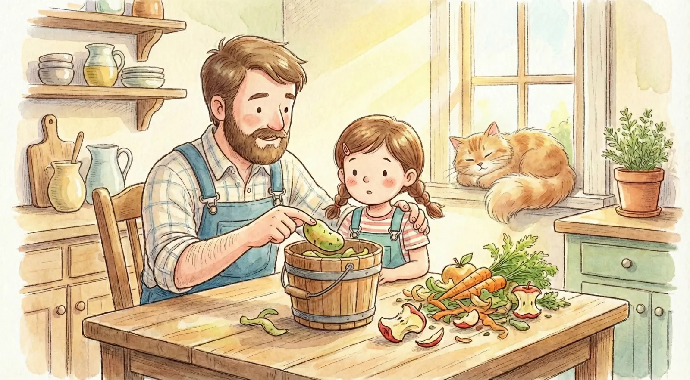

**Les aliments les plus toxiques pour les poules sont les épluchures de pommes de terre crues (solanine), l'avocat (persine), le chocolat (théobromine), les oignons et l'ail crus, ainsi que les pépins de fruits (cyanure) et les haricots secs crus. Pour garantir la sécurité de votre élevage, évitez également tout aliment moisi, trop salé ou trop sucré.**

À "Mon Petit Poulailler", le moment des restes de cuisine est un vrai spectacle. **Barnabé** le chien guette toujours une miette tombée, tandis que nos poules se précipitent sur le seau que leur apporte **Lucas**. Mais attention : recycler ses déchets est un geste écologique merveilleux, à condition de savoir que certains aliments courants peuvent être mortels pour vos protégées. 

Avec **Julie**, nous avons établi une liste stricte pour que les enfants ne fassent jamais d'erreur fatale. En tant qu'expert menuisier et passionné de nutrition avicole, je vous aide à y voir clair pour protéger votre petit cheptel.

## 📊 Synthèse visuelle de la Toxicité

Pour vous aider à mémoriser les dangers, voici notre "échelle de vigilance" familiale :


graph TD
A[Aliments pour Poules] --> B(Risques Sanitaires)
B --> C{Niveau de Danger}
C -->|🔴 MORTEL| D[Avocat, Chocolat, Épluchures de Pdt crues]
C -->|🟠 TOXIQUE| E[Oignons, Ail en excès, Haricots crus]
C -->|🟡 À ÉVITER| F[Pain blanc, Agrumes, Restes trop salés]
style D fill:#ffcccc,stroke:#ff0000,stroke-width:2px
style E fill:#fff4dd,stroke:#d4a017,stroke-width:2px
style F fill:#e1f5fe,stroke:#01579b,stroke-width:2px


## 1. La Famille des Solanacées (Crues)

C'est l'erreur la plus fréquente au poulailler. Certains légumes de nos potagers sont dangereux lorsqu'ils sont crus ou encore verts.

| Aliment Toxique | Partie Dangereuse | Pourquoi ? |
| :--- | :--- | :--- |
| **Pomme de terre** | Peau, germes, zones vertes | Contient de la **solanine** (neurotoxique). |
| **Tomate** | Tige, feuilles, fruits verts | Solanine concentrée dans les parties vertes. |
| **Aubergine / Poivron** | Plante et fruits non mûrs | Toxines de la famille de la solanine. |


**Le conseil de Martin :** Si vous voulez donner des pommes de terre, elles doivent être parfaitement cuites à l'eau et l'eau de cuisson doit être impérativement jetée. Pour en savoir plus, lisez notre [guide sur les pommes de terre]().


## 2. Fruits Exotiques et Pépins

Certains fruits sains pour nous sont de véritables poisons pour elles.

* **L'Avocat :** La peau et le noyau contiennent de la **persine**, une toxine qui peut causer des troubles cardiaques foudroyants. Même **Pistache** la poule n'y a pas droit !
* **Les Pépins et Noyaux :** Les pépins de pommes ou de poires contiennent de l'amygdaline, qui se transforme en **cyanure** lors de la digestion. Retirez impérativement le cœur des fruits !

## 3. Bulbes et Odeurs Fortes

L'ail, l'oignon, le poireau et l'échalote (crus) s'attaquent aux globules rouges de la poule et peuvent provoquer une anémie. De plus, ils donnent un goût désagréable aux œufs frais que **Anna** ramasse chaque matin.

## 4. Sel, Sucre et Graisses

* **Le Sel :** Les poules y sont extrêmement sensibles. Un excès de sodium entraîne une déshydratation sévère et des problèmes rénaux. Évitez absolument les plats cuisinés industriels.
* **Le Chocolat :** Il contient de la théobromine, toxique pour leur cœur et leur système nerveux.



## 5. Légumineuses et Haricots Crus

Les haricots secs crus contiennent de la **phytohémagglutinine**, une lectine extrêmement toxique qui provoque des lésions intestinales graves en quelques heures.

## 📋 La "Liste Noire" récapitulative


* ❌ **Avocat** (peau et noyau)
* ❌ **Chocolat** et bonbons
* ❌ **Oignons et Ail crus**
* ❌ **Parties vertes des pommes de terre**
* ❌ **Pépins de pommes et poires**
* ❌ **Haricots secs crus**
* ❌ **Aliments moisis** (risque de botulisme mortel)


## ⚠️ Urgence : Que faire en cas d'ingestion ?

Si vous voyez l'une de vos poules léthargique, avec une diarrhée sévère ou en difficulté respiratoire après avoir mangé un aliment suspect :

1. **Isolez** la poule dans un endroit calme.
2. **Retirez** immédiatement la source de nourriture suspecte de l'enclos.
3. **Hydratez-la** avec de l'eau fraîche et propre.
4. **Contactez un vétérinaire** aviaire sans tarder.

## Conclusion

Un bon éleveur est un éleveur vigilant. Privilégiez toujours une base de granulés de qualité, de l'herbe fraîche et des légumes mûrs. Vos poules vous remercieront avec de magnifiques œufs sains pour toute la famille !

---

**À découvrir aussi :**

* [Peut-on donner du pain aux poules ?]()
* [Guide complet des épluchures]()