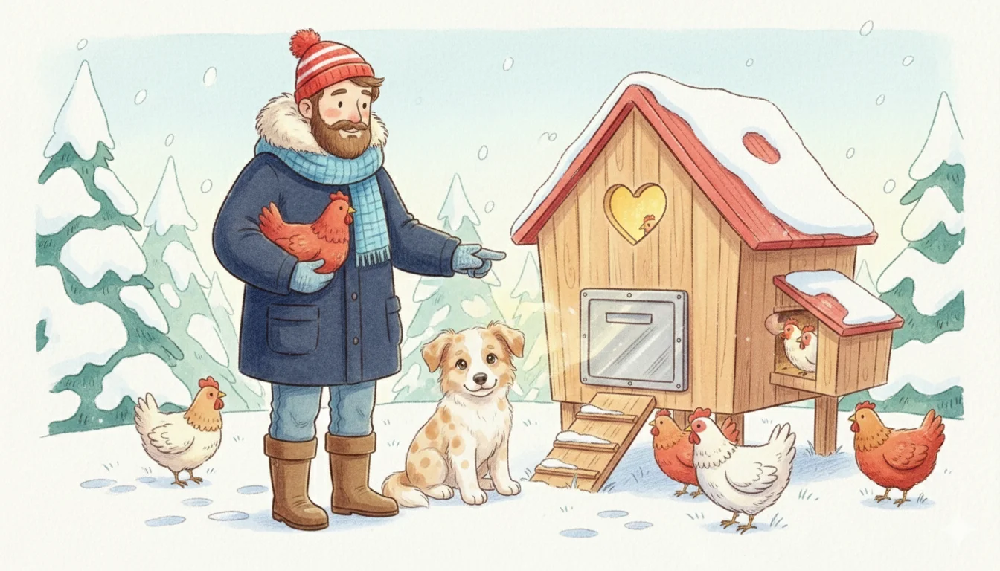

****
**La porte automatique de poulailler est un investissement indispensable pour garantir la sécurité de vos poules contre les prédateurs nocturnes comme le renard et assurer votre propre confort. Elle fonctionne via un capteur de luminosité ou une minuterie, offrant un verrouillage robuste qui libère l'éleveur des contraintes horaires du matin et du soir.**

---

Être éleveur est une passion merveilleuse, mais elle a un prix : celui du réveil à l'aube. Combien de fois **Julie** ou moi-même avons-nous dû écourter une soirée ou sacrifier une grasse matinée dominicale pour ouvrir ou fermer le poulailler ? Sans compter l'angoisse de savoir si les poules sont bien à l'abri quand nous rentrons tard. 

À "Mon Petit Poulailler", la porte automatique a tout changé. C'est le rempart ultime pour la tranquillité de la famille et la sécurité de nos protégées.

## ⚙️ Comment ça marche ? Lumière ou Minuterie ?
Le mécanisme motorisé pilote une trappe selon deux modes principaux :

1. **Le Capteur de Luminosité (Mode Crépusculaire) :** C'est le mode le plus naturel. La porte suit le rythme du soleil. Elle se ferme quand l'obscurité tombe (quand les poules sont déjà perchées) et s'ouvre à l'aube.
2. **La Minuterie Programmable (Mode Horloge) :** Vous décidez de l'heure exacte. C'est idéal si votre poulailler est situé dans une zone très ombragée qui pourrait fausser le capteur.


**Le conseil de Martin :** Je vous recommande le **mode hybride**. Utilisez le capteur pour l'ouverture, mais programmez une heure de fermeture maximale de sécurité (par exemple 22h00 en été). Cela garantit que la porte se fermera même si une lumière parasite (phare de voiture, lampe de jardin) perturbe le capteur.


## 🛡️ Les 3 Avantages Majeurs

### 1. Sécurité Anti-Prédateur Maximale
Le renard est un opportuniste nocturne. La plupart des attaques ont lieu juste après le coucher du soleil. La porte automatique se ferme au moment critique, créant un rempart en aluminium souvent impossible à soulever ou à forcer pour un animal.

### 2. Le confort d'une Grasse Matinée
C'est l'argument préféré de Julie ! Finies les sorties en pyjama dans le froid à 6 heures du matin. Vos poules sont libérées au moment idéal, et vous profitez de votre sommeil.

### 3. Sérénité pendant les vacances
Partir en week-end devient simple. La porte gère les cycles quotidiens. Votre voisin n'a plus qu'à passer vérifier l'eau et la nourriture, sans contrainte horaire stricte.

## 🛠️ Une installation à la portée de tous
En tant que menuisier, j'apprécie la simplicité de ces systèmes. La plupart des modèles s'installent en moins de 20 minutes avec seulement quatre vis pour fixer le boîtier moteur et les rails de guidage. 

Les systèmes fonctionnent sur piles ou via un petit panneau solaire, ce qui évite de devoir tirer des câbles électriques dans tout le jardin. C'est une installation sans danger et accessible à tous.

## 🥇 Notre Sélection de Modèles Fiables

| Modèle recommandé | Caractéristique principale | Énergie | Lien |
| :--- | :--- | :--- | :--- |
| **Modèle Solaire Hybride** | Le top du confort (Chamuty) | Solaire & Batterie |  |
| **Modèle Aluminium Robuste** | Qualité menuisier (Run-Chicken) | Piles ou Solaire |  |
| **Modèle Express Piles** | La référence (ChickenGuard) | Piles AA |  |

## Conclusion
Si vous hésitez encore, demandez à n'importe quel propriétaire de poules : la porte automatique est l'achat qu'on ne regrette jamais. Pour le prix de quelques sacs de grains, vous offrez à votre famille la sérénité et à vos poules une sécurité d'acier. **Barnabé** pourra monter la garde le jour, la technologie prendra le relais la nuit !

---
**Besoin de plus de conseils ?** Consultez notre [Check-list des 10 accessoires indispensables]() pour finaliser votre installation.